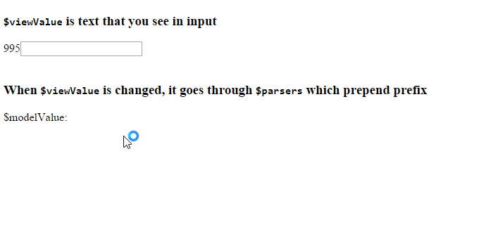
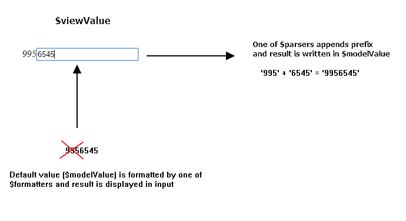

## Simple prefix directive showing `$parsers` and `$formatters` in action

Sometimes you want to format model value before displaying it in the input or
want to parse value that user enters in input before updating model value. Angular has `$parsers` and `$formatters`
for this purpose. To demonstrate how it works, let's create directive that appends prefix to what you type in
input.



### Steps:
Include scripts in the bottom of body tag:

```html
<!-- Angular -->
<script src="https://ajax.googleapis.com/ajax/libs/angularjs/1.4.5/angular.min.js"></script>

<!-- Prefix directive and app module -->
<script src="./index.js"></script>
```

Bootstrap `app` module:

```html
<body ng-app="app">
```

Create `app` module:

```javascript
var app = angular.module('app', []);
```

Create prefix directive

```javascript
app.directive('prefix', [function () {
    return {
        restrict: 'A',
        require: 'ngModel',
        link: function (scope, element, attrs, modelCtrl) {
            // This will execute first time, convert model value into format that shall be displayed in input
            modelCtrl.$formatters.push(function (value) {
                if (value && typeof value === 'string' && value.indexOf(modelCtrl.$modelValue) === 0) {
                    return value.substring(attrs.prefix.length, value.length);
                }
            });

            // This will execute every tame user types in input
            modelCtrl.$parsers.push(function prependPrefix(value) {
                return attrs.prefix && value ? attrs.prefix + value : null;
            });
        }
    };
}]);
```

`$parsers` and `$formatters` are properties of `ngModelController`. We can require model controller passing `require: 'ngModel'` option to directive. Then we have model controller available as 4th parameter of `link` function (`modelCtrl`).

Directive in action:

```html
995<input type="text" ng-model="phoneNumber" prefix="995" />
```

### Lifecycle


